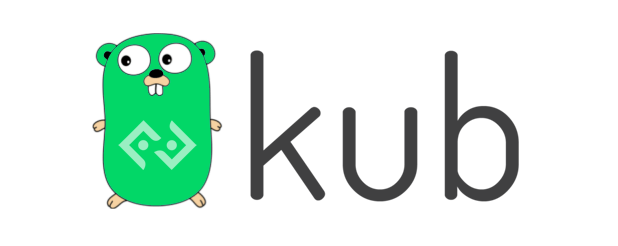

# gokub-bot

Bitkub Trading bot Open Source.

## Community
- [Discord](https://discord.gg/9WSA7mMuGm)

## TODO
- [x] Bitkub API golang library
- [ ] เริ่มด้วย Rebalancing Bot ก่อนละกันดูจะ ง่ายสุด (In Progress)
- [ ] Grid Trading ยังไม่รู้ทำไง ใครรู้สอนหน่อยสิ

## Features
- Application GUI (`Windows`, `Linux`, `Mac`)
- Support Docker Image
- Support K8s Multiple Deploy

## Ref
- [Official Documentation for Bitkub APIs](https://github.com/bitkub/bitkub-official-api-docs)
